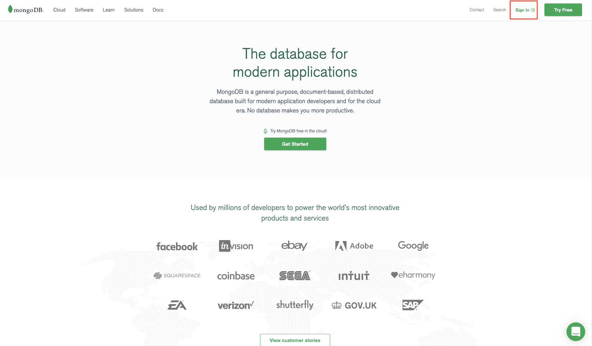
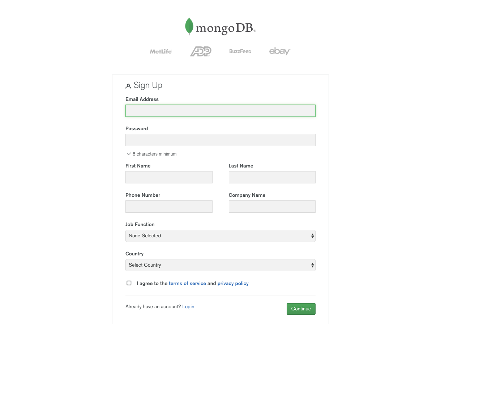
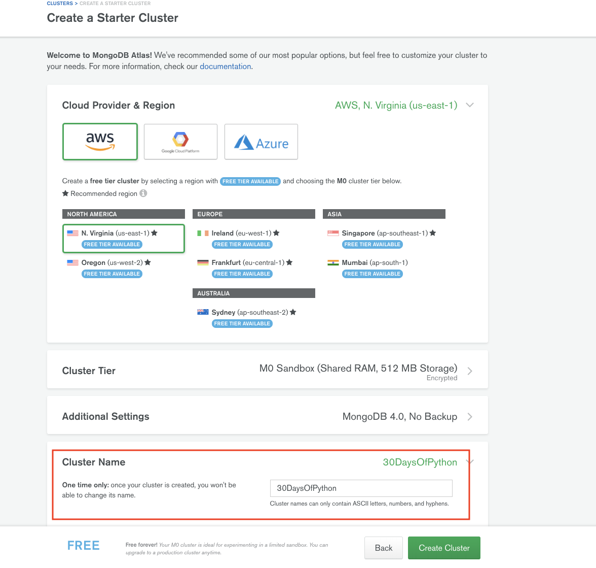
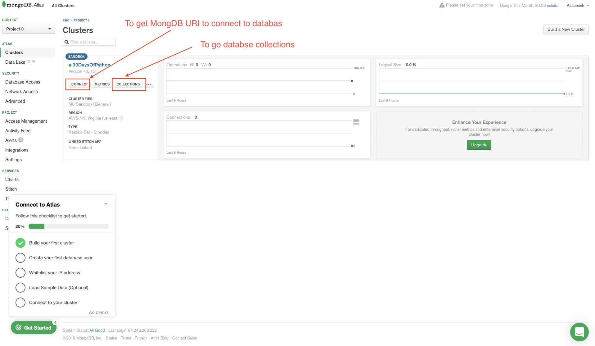
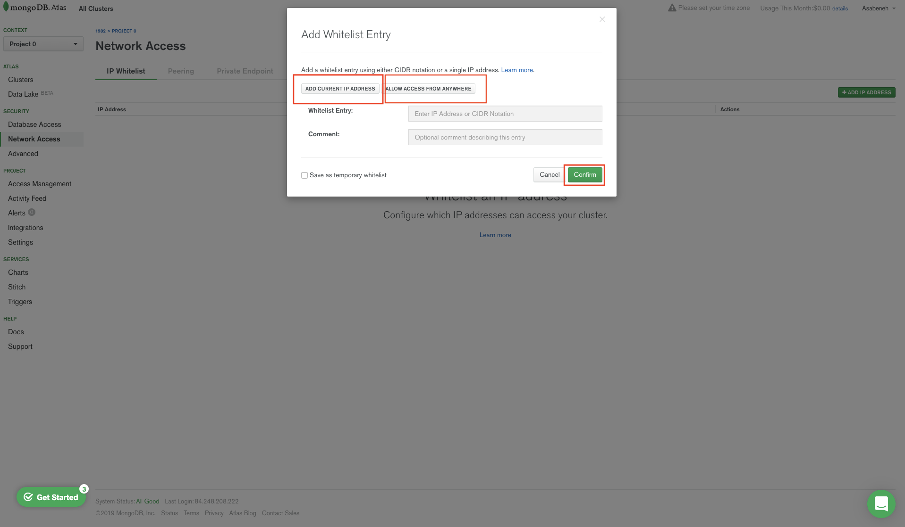
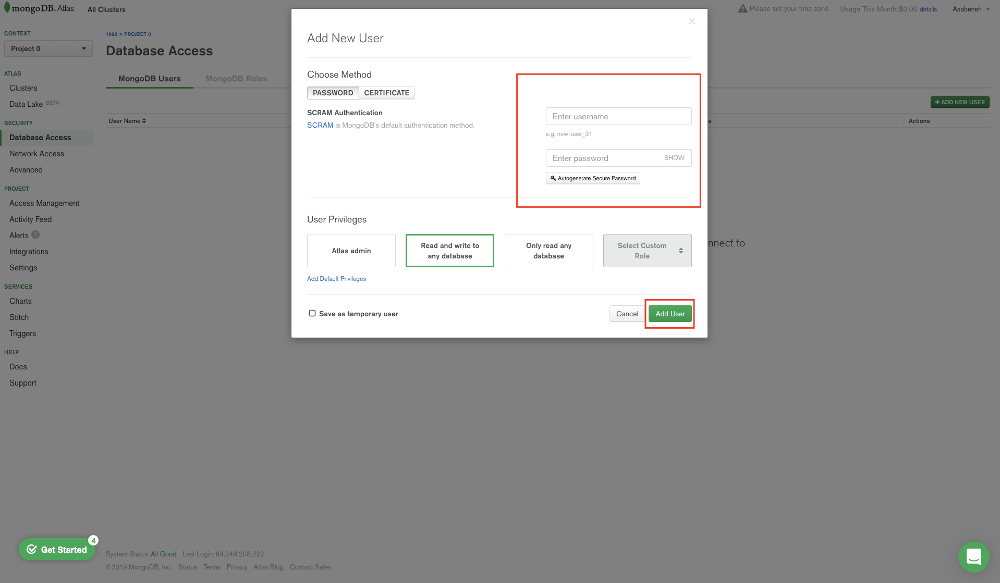
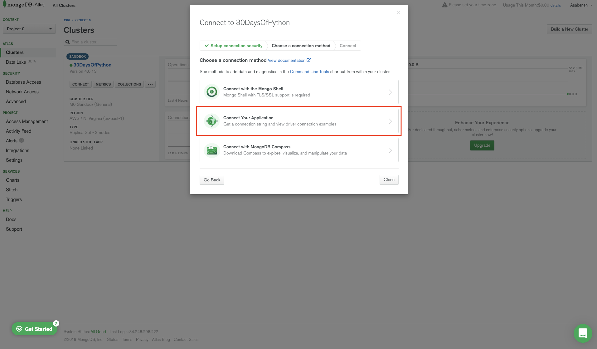
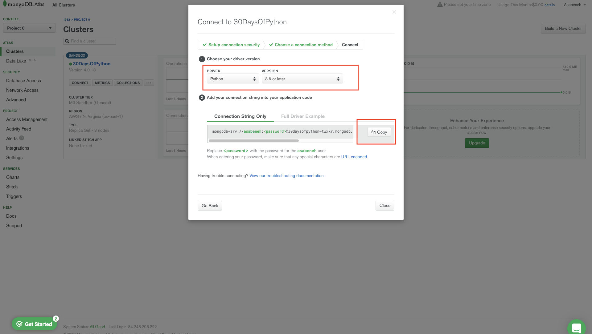
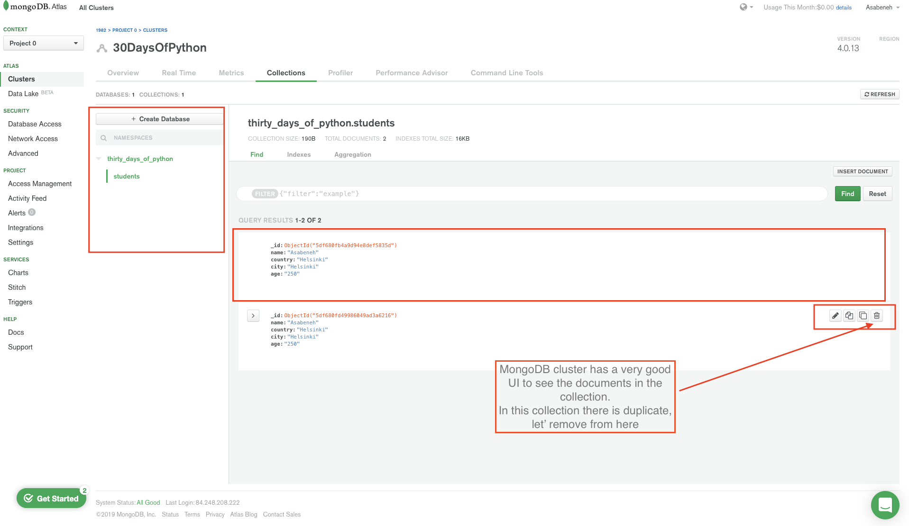

<div align="center">
  <h1> Python In 30 Days: Day 27 - Python with MongoDB </h1>
  

<sub>Author:
<a href="https://github.com/camit001" target="_blank">Amit Kumar</a><br>

</sub>

</div>

[<< Day 26](../Day_26_Python_web/26_Python_web.md) | [Day 28 >>](../Day_28_API/28_API.md)


**[Python In 30 Days]**
- [📘 Day 27](#-day-27)
- [Python with MongoDB](#python-with-mongodb)
  - [MongoDB](#mongodb)
    - [SQL versus NoSQL](#sql-versus-nosql)
    - [Getting Connection String(MongoDB URI)](#getting-connection-stringmongodb-uri)
    - [Connecting Flask application to MongoDB Cluster](#connecting-flask-application-to-mongodb-cluster)
    - [Creating a database and collection](#creating-a-database-and-collection)
    - [Inserting many documents to collection](#inserting-many-documents-to-collection)
    - [MongoDB Find](#mongodb-find)
    - [Find with Query](#find-with-query)
    - [Find query with modifier](#find-query-with-modifier)
    - [Limiting documents](#limiting-documents)
    - [Find with sort](#find-with-sort)
    - [Update with query](#update-with-query)
    - [Delete Document](#delete-document)
    - [Drop a collection](#drop-a-collection)
  - [💻 Exercises: Day 27](#-exercises-day-27)

# 📘 Day 27

# Python with MongoDB

Python is a backend technology and it can be connected with different database applications. It can be connected to both SQL and NoSQL databases. In this section, we connect Python with MongoDB database which is NoSQL database. 

## MongoDB

MongoDB is a NoSQL database. MongoDB stores data in a JSON like document which makes MongoDB very flexible and scalable. Let us see the different terminologies of SQL and NoSQL databases. The following table will make the difference between SQL versus NoSQL databases.

### SQL versus NoSQL

**[SQL versus NoSQL]**

In this section, we will focus on a NoSQL database MongoDB. Let's sign up on [MongoDB](https://www.mongodb.com/) by click on the sign in button then click register on the next page..



Complete the fields and click continue



Select the free plan


Choose the proximate free region and give any name for you cluster.



Now, a free sandbox is created



All local host access



Add user and password



Create a MongoDB uri link



Select Python 3.6 or above driver



### Getting Connection String(MongoDB URI)

Copy the connection string link and you will get something like this:

```sh
mongodb+srv://amit:<password>@30daysofpython-twxkr.mongodb.net/test?retryWrites=true&w=majority
```

Do not worry about the url, it is a means to connect your application with MongoDB.
Let us replace the password placeholder with the password you used to add a user.

**Example:**

```sh
mongodb+srv://<username>:<password>@<cluster-url>/<database>?retryWrites=true&w=majority
```

Now, I replaced everything and the password is 123123 and the name of the database is *thirty_days_python*. This is just an example, your password must be stronger than the example password.

Python needs a MongoDB driver to access MongoDB database. We will use _pymongo_ with _dnspython_ to connect our application with MongoDB base . Inside your project directory install pymongo and dnspython.

```sh
pip install pymongo dnspython
```

> **Security note:** Never hard-code your real MongoDB username or password in source code.
> Store the connection string in an environment variable instead.

```py
import os
import pymongo

MONGODB_URI = os.environ["MONGODB_URI"]
client = pymongo.MongoClient(MONGODB_URI)

# Test the connection
client.admin.command("ping")
print("MongoDB connection successful")
```

For local development, you can keep `MONGODB_URI` in a `.env` file and load it with
`python-dotenv`. Do not commit `.env` to Git.


The "dnspython" module must be installed to use mongodb+srv:// URIs. The dnspython is a DNS toolkit for Python. It supports almost all record types.

### Connecting Flask application to MongoDB Cluster

```py
# let's import Flask
from flask import Flask, render_template
import os
import pymongo
MONGODB_URI = 'mongodb+srv://<username>:<password>@<cluster-url>/<database>?retryWrites=true&w=majority'
client = pymongo.MongoClient(MONGODB_URI)
print(client.list_database_names())

app = Flask(__name__)
if __name__ == '__main__':
    # for deployment we use the environ
    # to make it work for both production and development
    port = int(os.environ.get("PORT", 5000))
    app.run(debug=True, host='0.0.0.0', port=port)

```

When we run the above code we get the default MongoDB databases.

```sh
['admin', 'local']
```

### Creating a database and collection

Let us create a database, database and collection in MongoDB will be created if it doesn't exist. Let's create a database name *thirty_days_of_python* and *students* collection.

To create a database:

```sh
db = client.name_of_databse # we can create a database like this or the second way
db = client['name_of_database']
```

```py
# let's import Flask
from flask import Flask, render_template
import os
import pymongo
MONGODB_URI = 'mongodb+srv://<username>:<password>@<cluster-url>/<database>?retryWrites=true&w=majority'
client = pymongo.MongoClient(MONGODB_URI)
# Creating database
db = client.thirty_days_of_python
# Creating students collection and inserting a document
db.students.insert_one({'name': 'Amit Kumar', 'country': 'India', 'city': 'Mumbai', 'age': 250})
print(client.list_database_names())

app = Flask(__name__)
if __name__ == '__main__':
    # for deployment we use the environ
    # to make it work for both production and development
    port = int(os.environ.get("PORT", 5000))
    app.run(debug=True, host='0.0.0.0', port=port)
```

After we create a database, we also created a students collection and we used *insert_one()* method to insert a document.
Now, the database *thirty_days_of_python* and *students* collection have been created and the document has been inserted.
Check your MongoDB cluster and you will see both the database and the collection. Inside the collection, there will be a document.

```sh
['thirty_days_of_python', 'admin', 'local']
```

If you see this on the MongoDB cluster, it means you have successfully created a database and a collection.



If you have seen on the figure, the document has been created with a long id which acts as a primary key. Every time we create a document MongoDB create and unique id for it.

### Inserting many documents to collection

The *insert_one()*  method inserts one item at a time if we want to insert many documents at once either we use *insert_many()* method or for loop.
We can use for loop to insert many documents at once.

```py
# let's import Flask
from flask import Flask, render_template
import os
import pymongo
MONGODB_URI = 'mongodb+srv://<username>:<password>@<cluster-url>/<database>?retryWrites=true&w=majority'
client = pymongo.MongoClient(MONGODB_URI)

students = [
        {'name':'David','country':'UK','city':'London','age':34},
        {'name':'John','country':'Sweden','city':'Stockholm','age':28},
        {'name':'Sami','country':'India','city':'Mumbai','age':25},
    ]
for student in students:
    db.students.insert_one(student)


app = Flask(__name__)
if __name__ == '__main__':
    # for deployment we use the environ
    # to make it work for both production and development
    port = int(os.environ.get("PORT", 5000))
    app.run(debug=True, host='0.0.0.0', port=port)
```

### MongoDB Find

The *find()* and *find_one()* methods are common method to find data in a collection in MongoDB database. It is similar to the SELECT statement in a MySQL database.
Let us use the _find_one()_ method to get a document in a database collection.

- \*find_one({"\_id": ObjectId("id"}): Gets the first occurrence if an id is not provided

```py
# let's import Flask
from flask import Flask, render_template
import os
import pymongo
MONGODB_URI = 'mongodb+srv://<username>:<password>@<cluster-url>/<database>?retryWrites=true&w=majority'
client = pymongo.MongoClient(MONGODB_URI)
db = client['thirty_days_of_python'] # accessing the database
student = db.students.find_one()
print(student)


app = Flask(__name__)
if __name__ == '__main__':
    # for deployment we use the environ
    # to make it work for both production and development
    port = int(os.environ.get("PORT", 5000))
    app.run(debug=True, host='0.0.0.0', port=port)

```

```sh
{'_id': ObjectId('5df68a21f106fe2d315bbc8b'), 'name': 'Amit Kumar', 'country': 'Mumbai', 'city': 'Mumbai', 'age': 250}
```

The above query returns the first entry but we can target specific document using specific \_id. Let us do one example, use David's id to get David object.
'\_id':ObjectId('5df68a23f106fe2d315bbc8c')

```py
# let's import Flask
from flask import Flask, render_template
import os
import pymongo
from bson.objectid import ObjectId # id object
MONGODB_URI = 'mongodb+srv://<username>:<password>@<cluster-url>/<database>?retryWrites=true&w=majority'
client = pymongo.MongoClient(MONGODB_URI)
db = client['thirty_days_of_python'] # accessing the database
student = db.students.find_one({'_id':ObjectId('5df68a23f106fe2d315bbc8c')})
print(student)

app = Flask(__name__)
if __name__ == '__main__':
    # for deployment we use the environ
    # to make it work for both production and development
    port = int(os.environ.get("PORT", 5000))
    app.run(debug=True, host='0.0.0.0', port=port)
```

```sh
{'_id': ObjectId('5df68a23f106fe2d315bbc8c'), 'name': 'David', 'country': 'UK', 'city': 'London', 'age': 34}
```

We have seen, how to use _find_one()_ using the above examples. Let's move one to _find()_

- _find()_: returns all the occurrence from a collection if we don't pass a query object. The object is pymongo.cursor object.

```py
# let's import Flask
from flask import Flask, render_template
import os
import pymongo

MONGODB_URI = 'mongodb+srv://<username>:<password>@<cluster-url>/<database>?retryWrites=true&w=majority'
client = pymongo.MongoClient(MONGODB_URI)
db = client['thirty_days_of_python'] # accessing the database
students = db.students.find()
for student in students:
    print(student)

app = Flask(__name__)
if __name__ == '__main__':
    # for deployment we use the environ
    # to make it work for both production and development
    port = int(os.environ.get("PORT", 5000))
    app.run(debug=True, host='0.0.0.0', port=port)
```

```sh
{'_id': ObjectId('5df68a21f106fe2d315bbc8b'), 'name': 'Amit Kumar', 'country': 'India', 'city': 'Mumbai', 'age': 250}
{'_id': ObjectId('5df68a23f106fe2d315bbc8c'), 'name': 'David', 'country': 'UK', 'city': 'London', 'age': 34}
{'_id': ObjectId('5df68a23f106fe2d315bbc8d'), 'name': 'John', 'country': 'Sweden', 'city': 'Stockholm', 'age': 28}
{'_id': ObjectId('5df68a23f106fe2d315bbc8e'), 'name': 'Sami', 'country': 'India', 'city': 'Mumbai', 'age': 25}
```

We can specify which fields to return by passing second object in the _find({}, {})_. 0 means not include and 1 means include but we can not mix 0 and 1, except for \_id.

```py
# let's import Flask
from flask import Flask, render_template
import os
import pymongo

MONGODB_URI = 'mongodb+srv://<username>:<password>@<cluster-url>/<database>?retryWrites=true&w=majority'
client = pymongo.MongoClient(MONGODB_URI)
db = client['thirty_days_of_python'] # accessing the database
students = db.students.find({}, {"_id":0,  "name": 1, "country":1}) # 0 means not include and 1 means include
for student in students:
    print(student)

app = Flask(__name__)
if __name__ == '__main__':
    # for deployment we use the environ
    # to make it work for both production and development
    port = int(os.environ.get("PORT", 5000))
    app.run(debug=True, host='0.0.0.0', port=port)
```

```sh
{'name': 'Amit Kumar', 'country': 'India'}
{'name': 'David', 'country': 'UK'}
{'name': 'John', 'country': 'Sweden'}
{'name': 'Sami', 'country': 'India'}
```

### Find with Query

In MongoDB find take a query object. We can pass a query object and we can filter the documents we like to filter out.

```py
# let's import Flask
from flask import Flask, render_template
import os
import pymongo

MONGODB_URI = 'mongodb+srv://<username>:<password>@<cluster-url>/<database>?retryWrites=true&w=majority'
client = pymongo.MongoClient(MONGODB_URI)
db = client['thirty_days_of_python'] # accessing the database

query = {
    "country":"India"
}
students = db.students.find(query)

for student in students:
    print(student)


app = Flask(__name__)
if __name__ == '__main__':
    # for deployment we use the environ
    # to make it work for both production and development
    port = int(os.environ.get("PORT", 5000))
    app.run(debug=True, host='0.0.0.0', port=port)
```

```sh
{'_id': ObjectId('5df68a21f106fe2d315bbc8b'), 'name': 'Amit Kumar', 'country': 'India', 'city': 'Mumbai', 'age': 250}
{'_id': ObjectId('5df68a23f106fe2d315bbc8e'), 'name': 'Sami', 'country': 'India', 'city': 'Mumbai', 'age': 25}
```

Query with modifiers

```py
# let's import Flask
from flask import Flask, render_template
import os
import pymongo
import pymongo

MONGODB_URI = 'mongodb+srv://<username>:<password>@<cluster-url>/<database>?retryWrites=true&w=majority'
client = pymongo.MongoClient(MONGODB_URI)
db = client['thirty_days_of_python'] # accessing the database

query = {
    "city":"Mumbai"
}
students = db.students.find(query)
for student in students:
    print(student)


app = Flask(__name__)
if __name__ == '__main__':
    # for deployment we use the environ
    # to make it work for both production and development
    port = int(os.environ.get("PORT", 5000))
    app.run(debug=True, host='0.0.0.0', port=port)
```

```sh
{'_id': ObjectId('5df68a21f106fe2d315bbc8b'), 'name': 'Amit Kumar', 'country': 'India', 'city': 'Mumbai', 'age': 250}
{'_id': ObjectId('5df68a23f106fe2d315bbc8e'), 'name': 'Sami', 'country': 'India', 'city': 'Mumbai', 'age': 25}
```

### Find query with modifier

```py
# let's import Flask
from flask import Flask, render_template
import os
import pymongo
import pymongo

MONGODB_URI = 'mongodb+srv://<username>:<password>@<cluster-url>/<database>?retryWrites=true&w=majority'
client = pymongo.MongoClient(MONGODB_URI)
db = client['thirty_days_of_python'] # accessing the database
query = {
    "country":"India",
    "city":"Mumbai"
}
students = db.students.find(query)
for student in students:
    print(student)


app = Flask(__name__)
if __name__ == '__main__':
    # for deployment we use the environ
    # to make it work for both production and development
    port = int(os.environ.get("PORT", 5000))
    app.run(debug=True, host='0.0.0.0', port=port)
```

```sh
{'_id': ObjectId('5df68a21f106fe2d315bbc8b'), 'name': 'Amit Kumar', 'country': 'India', 'city': 'Mumbai', 'age': 250}
{'_id': ObjectId('5df68a23f106fe2d315bbc8e'), 'name': 'Sami', 'country': 'India', 'city': 'Mumbai', 'age': 25}
```

Query with modifiers

```py
# let's import Flask
from flask import Flask, render_template
import os
import pymongo
import pymongo

MONGODB_URI = 'mongodb+srv://<username>:<password>@<cluster-url>/<database>?retryWrites=true&w=majority'
client = pymongo.MongoClient(MONGODB_URI)
db = client['thirty_days_of_python'] # accessing the database
query = {"age":{"$gt":30}}
students = db.students.find(query)
for student in students:
    print(student)

app = Flask(__name__)
if __name__ == '__main__':
    # for deployment we use the environ
    # to make it work for both production and development
    port = int(os.environ.get("PORT", 5000))
    app.run(debug=True, host='0.0.0.0', port=port)
```

```sh
{'_id': ObjectId('5df68a21f106fe2d315bbc8b'), 'name': 'Amit Kumar', 'country': 'India', 'city': 'Mumbai', 'age': 250}
{'_id': ObjectId('5df68a23f106fe2d315bbc8c'), 'name': 'David', 'country': 'UK', 'city': 'London', 'age': 34}
```

```py
# let's import Flask
from flask import Flask, render_template
import os
import pymongo
import pymongo

MONGODB_URI = 'mongodb+srv://<username>:<password>@<cluster-url>/<database>?retryWrites=true&w=majority'
client = pymongo.MongoClient(MONGODB_URI)
db = client['thirty_days_of_python'] # accessing the database
query = {"age":{"$gt":30}}
students = db.students.find(query)
for student in students:
    print(student)
```

```sh
{'_id': ObjectId('5df68a23f106fe2d315bbc8d'), 'name': 'John', 'country': 'Sweden', 'city': 'Stockholm', 'age': 28}
{'_id': ObjectId('5df68a23f106fe2d315bbc8e'), 'name': 'Sami', 'country': 'India', 'city': 'Mumbai', 'age': 25}
```

### Limiting documents

We can limit the number of documents we return using the _limit()_ method.

```py
# let's import Flask
from flask import Flask, render_template
import os
import pymongo
import pymongo

MONGODB_URI = 'mongodb+srv://<username>:<password>@<cluster-url>/<database>?retryWrites=true&w=majority'
client = pymongo.MongoClient(MONGODB_URI)
db = client['thirty_days_of_python'] # accessing the database
db.students.find().limit(3)
```

### Find with sort

By default, sort is in ascending order. We can change the sorting to descending order by adding -1 parameter.

```py
# let's import Flask
from flask import Flask, render_template
import os
import pymongo
import pymongo

MONGODB_URI = 'mongodb+srv://<username>:<password>@<cluster-url>/<database>?retryWrites=true&w=majority'
client = pymongo.MongoClient(MONGODB_URI)
db = client['thirty_days_of_python'] # accessing the database
students = db.students.find().sort('name')
for student in students:
    print(student)


students = db.students.find().sort('name',-1)
for student in students:
    print(student)

students = db.students.find().sort('age')
for student in students:
    print(student)

students = db.students.find().sort('age',-1)
for student in students:
    print(student)

app = Flask(__name__)
if __name__ == '__main__':
    # for deployment we use the environ
    # to make it work for both production and development
    port = int(os.environ.get("PORT", 5000))
    app.run(debug=True, host='0.0.0.0', port=port)
```

Ascending order

```sh
{'_id': ObjectId('5df68a21f106fe2d315bbc8b'), 'name': 'Amit Kumar', 'country': 'India', 'city': 'Mumbai', 'age': 250}
{'_id': ObjectId('5df68a23f106fe2d315bbc8c'), 'name': 'David', 'country': 'UK', 'city': 'London', 'age': 34}
{'_id': ObjectId('5df68a23f106fe2d315bbc8d'), 'name': 'John', 'country': 'Sweden', 'city': 'Stockholm', 'age': 28}
{'_id': ObjectId('5df68a23f106fe2d315bbc8e'), 'name': 'Sami', 'country': 'India', 'city': 'Mumbai', 'age': 25}
```

Descending order

```sh
{'_id': ObjectId('5df68a23f106fe2d315bbc8e'), 'name': 'Sami', 'country': 'India', 'city': 'Mumbai', 'age': 25}
{'_id': ObjectId('5df68a23f106fe2d315bbc8d'), 'name': 'John', 'country': 'Sweden', 'city': 'Stockholm', 'age': 28}
{'_id': ObjectId('5df68a23f106fe2d315bbc8c'), 'name': 'David', 'country': 'UK', 'city': 'London', 'age': 34}
{'_id': ObjectId('5df68a21f106fe2d315bbc8b'), 'name': 'Amit Kumar', 'country': 'India', 'city': 'Mumbai', 'age': 250}
```

### Update with query

We will use *update_one()* method to update one item. It takes two object one is a query and the second is the new object.
The first person, Amit Kumar got a very implausible age. Let us update Amit Kumar's age.

```py
# let's import Flask
from flask import Flask, render_template
import os
import pymongo
import pymongo

MONGODB_URI = 'mongodb+srv://<username>:<password>@<cluster-url>/<database>?retryWrites=true&w=majority'
client = pymongo.MongoClient(MONGODB_URI)
db = client['thirty_days_of_python'] # accessing the database

query = {'age':250}
new_value = {'$set':{'age':38}}

db.students.update_one(query, new_value)
# lets check the result if the age is modified
for student in db.students.find():
    print(student)


app = Flask(__name__)
if __name__ == '__main__':
    # for deployment we use the environ
    # to make it work for both production and development
    port = int(os.environ.get("PORT", 5000))
    app.run(debug=True, host='0.0.0.0', port=port)
```

```sh
{'_id': ObjectId('5df68a21f106fe2d315bbc8b'), 'name': 'Amit Kumar', 'country': 'India', 'city': 'Mumbai', 'age': 38}
{'_id': ObjectId('5df68a23f106fe2d315bbc8c'), 'name': 'David', 'country': 'UK', 'city': 'London', 'age': 34}
{'_id': ObjectId('5df68a23f106fe2d315bbc8d'), 'name': 'John', 'country': 'Sweden', 'city': 'Stockholm', 'age': 28}
{'_id': ObjectId('5df68a23f106fe2d315bbc8e'), 'name': 'Sami', 'country': 'India', 'city': 'Mumbai', 'age': 25}
```

When we want to update many documents at once we use *update_many()* method.

### Delete Document

The method *delete_one()* deletes one document. The *delete_one()* takes a query object parameter. It only removes the first occurrence.
Let us remove one John from the collection.

```py
# let's import Flask
from flask import Flask, render_template
import os
import pymongo
import pymongo

MONGODB_URI = 'mongodb+srv://<username>:<password>@<cluster-url>/<database>?retryWrites=true&w=majority'
client = pymongo.MongoClient(MONGODB_URI)
db = client['thirty_days_of_python'] # accessing the database

query = {'name':'John'}
db.students.delete_one(query)

for student in db.students.find():
    print(student)
# lets check the result if the age is modified
for student in db.students.find():
    print(student)


app = Flask(__name__)
if __name__ == '__main__':
    # for deployment we use the environ
    # to make it work for both production and development
    port = int(os.environ.get("PORT", 5000))
    app.run(debug=True, host='0.0.0.0', port=port)
```

```sh
{'_id': ObjectId('5df68a21f106fe2d315bbc8b'), 'name': 'Amit Kumar', 'country': 'India', 'city': 'Mumbai', 'age': 38}
{'_id': ObjectId('5df68a23f106fe2d315bbc8c'), 'name': 'David', 'country': 'UK', 'city': 'London', 'age': 34}
{'_id': ObjectId('5df68a23f106fe2d315bbc8e'), 'name': 'Sami', 'country': 'India', 'city': 'Mumbai', 'age': 25}
```

As you can see John has been removed from the collection.

When we want to delete many documents we use *delete_many()* method, it takes a query object. If we pass an empty query object to *delete_many({})* it will delete all the documents in the collection.

### Drop a collection

Using the _drop()_ method we can delete a collection from a database.

```py
# let's import Flask
from flask import Flask, render_template
import os
import pymongo
import pymongo

MONGODB_URI = 'mongodb+srv://<username>:<password>@<cluster-url>/<database>?retryWrites=true&w=majority'
client = pymongo.MongoClient(MONGODB_URI)
db = client['thirty_days_of_python'] # accessing the database
db.students.drop()
```

Now, we have deleted the students collection from the database.

## Practical PyMongo CRUD Reference

The examples above cover the basic operations. This quick reference shows the most
commonly used PyMongo methods in one place.

| Operation | PyMongo method | Purpose |
|---|---|---|
| Insert one | `insert_one()` | Add one document |
| Insert many | `insert_many()` | Add multiple documents |
| Find one | `find_one()` | Return one matching document |
| Find many | `find()` | Return matching documents |
| Update one | `update_one()` | Update the first matching document |
| Update many | `update_many()` | Update all matching documents |
| Delete one | `delete_one()` | Delete the first matching document |
| Delete many | `delete_many()` | Delete all matching documents |
| Sort | `sort()` | Sort query results |
| Limit | `limit()` | Restrict the number of results |
| Count | `count_documents()` | Count matching documents |

### Example: Complete CRUD Flow

```py
import os
import pymongo

client = pymongo.MongoClient(os.environ["MONGODB_URI"])
db = client["python_in_30_days"]
students = db["students"]

# Create
students.insert_one({
    "name": "Amit Kumar",
    "country": "India",
    "city": "Mumbai",
    "age": 25
})

# Read
student = students.find_one({"name": "Amit Kumar"})
print(student)

# Update
students.update_one(
    {"name": "Amit Kumar"},
    {"$set": {"age": 26}}
)

# Delete
students.delete_one({"name": "Amit Kumar"})
```

### MongoDB Operators

MongoDB queries become much more useful when you use comparison and logical
operators.

```py
# Greater than
students.find({"age": {"$gt": 25}})

# Greater than or equal to
students.find({"age": {"$gte": 25}})

# Less than
students.find({"age": {"$lt": 30}})

# Not equal
students.find({"country": {"$ne": "India"}})

# Match either condition
students.find({
    "$or": [
        {"city": "Mumbai"},
        {"city": "Pune"}
    ]
})
```

### Projection

Projection lets you control which fields are returned.

```py
students.find(
    {"country": "India"},
    {"_id": 0, "name": 1, "city": 1}
)
```

### Indexes

Indexes can improve query performance when a collection becomes large.

```py
students.create_index("email")
```

Use indexes thoughtfully. Every index also consumes storage and adds work to
write operations.

## 💻 Exercises: Day 27

### Exercises: Level 1

1. Create a MongoDB database named `python_in_30_days`.
2. Create a `students` collection.
3. Insert at least five student documents containing `name`, `country`, `city`, and `age`.
4. Retrieve one student using `find_one()`.
5. Retrieve all students using `find()`.

### Exercises: Level 2

1. Find all students whose country is `India`.
2. Find students whose age is greater than `25`.
3. Return only the `name` and `city` fields.
4. Sort students by age in ascending and descending order.
5. Limit the result to three documents.
6. Update one student's city.
7. Update multiple students using `update_many()`.
8. Delete one student.
9. Delete multiple students using a condition.

### Exercises: Level 3

Build a small **Student Management API** using Flask and MongoDB.

Your API should support:

- `GET /students` - return all students
- `GET /students/<id>` - return one student
- `POST /students` - create a student
- `PUT /students/<id>` - update a student
- `DELETE /students/<id>` - delete a student

Store the MongoDB connection string in an environment variable rather than
hard-coding credentials.

### Exercises: Level 4 - Data Engineering Practice

Create a collection named `employees` and insert at least 10 records.

Each document should contain:

```py
{
    "employee_id": 101,
    "name": "Amit Kumar",
    "department": "Data Engineering",
    "city": "Mumbai",
    "salary": 75000
}
```

Then write queries to:

1. Find employees from Mumbai.
2. Find employees with salary greater than `70000`.
3. Sort employees by salary.
4. Return the top five highest-paid employees.
5. Update an employee's department.
6. Count employees in each department.
7. Create an index on `employee_id`.

🎉 CONGRATULATIONS! 🎉

[<< Day 26](../Day_26_Python_web/26_Python_web.md) | [Day 28 >>](../Day_28_API/28_API.md)
